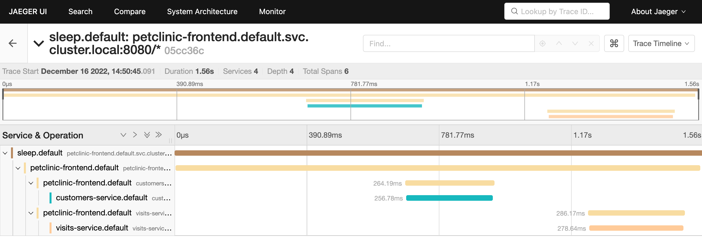

# Spring PetClinic on Istio

Derived from [Spring PetClinic Cloud](https://github.com/spring-petclinic/spring-petclinic-cloud).

For general information about the PetClinic sample application, see https://spring-petclinic.github.io/

## Summary

The basic idea is that there's a ton of "cruft" inside tons of files in spring-petclinic that relate to "spring-cloud": configuration for service discovery, load balancing, routing, retries, resilience, etc.. None of that is an app's concern when you move to Istio. So we can get rid of it all. And little by little our apps become sane again.

## Local Setup

On a Mac running Docker Desktop or Rancher Desktop, make sure to give your VM plenty of CPU and memory.
16GB of memory and 6 CPUs seems to work for me.

Deploy a local [K3D](https://k3d.io/) Kubernetes cluster with a local registry:

```shell
k3d cluster create my-istio-cluster \
  --api-port 6443 \
  --k3s-arg "--disable=traefik@server:0" \
  --port 80:80@loadbalancer \
  --registry-create my-cluster-registry:0.0.0.0:5010
```

Above, we:
- Disable the default traefik load balancer and configure local port 80 to instead forward to the "istio-ingressgateway" load balancer.
- Create a registry we can push to locally on port 5010 that is accessible from the Kubernetes cluster at "my-cluster-registry:5000".

## Remote Setup

Provision a k8s cluster in the cloud of your choice.  For example, on GCP:

```shell
gcloud container clusters create my-istio-cluster \
  --cluster-version latest \
  --machine-type "e2-standard-2" \
  --num-nodes "3" \
  --network "default"
```

## Instructions

1. Use the file `envrc-template.sh` as the basis for configuring environment variables, as follows:

    1. Set the local variable `local_setup` to either "true" or "false"
    2. If using a remote setup, set the value of PUSH_IMAGE_REGISTRY to the value of your image registry url

1. Deploy Istio:

    ```shell
    istioctl install -f istio-install-manifest.yaml
    ```

    The manifest enables proxying of mysql databases in addition to the rest services.

1. Label the default namespace for sidecar injection:

    ```shell
    kubectl label ns default istio-injection=enabled
    ```

## Deploy each microservice's backing database

Deployment decisions:

- We use mysql.  Mysql can be installed with helm.  Its charts are in the bitnami repository.
- We deploy a separate database statefulset for each service
- Inside each statefulset we name the database "service_instance_db"
- Apps use the root username "root"
- The helm installation will generate a root user password in a secret
- The applications reference the secret name to get at the db credentials

### Preparatory steps

1. Add the helm repository:

   ```shell
   helm repo add bitnami https://charts.bitnami.com/bitnami
   ```

1. Update it:

   ```shell
   helm repo update
   ```

### Deploy the databases

Now we're ready to deploy the databases with a `helm install` command for each app/service:

1. Vets:

    ```bash
    helm install vets-db-mysql bitnami/mysql --set auth.database=service_instance_db
    ```

2. Visits:

    ```bash
    helm install visits-db-mysql bitnami/mysql --set auth.database=service_instance_db
    ```

3. Customers:

    ```bash
    helm install customers-db-mysql bitnami/mysql --set auth.database=service_instance_db
    ```

Wait for the pods to be ready (2/2 containers).

## Build the apps, create the docker images, push them to the local registry

1. Compile the apps and run the tests:

    ```shell
    mvn clean package
    ```

2. Build the images

    ```shell
    mvn spring-boot:build-image
    ```

3. Publish the images

    ```shell
    ./push-images.sh
    ```

## Deploy the apps

The deployment manifests are located in the folder named `manifests`.

1. The services are vets, visits, customers, and the frontend.  For each service we create a Kubernetes Service Account, a Deployment, and a ClusterIP service.
2. [`routes.yaml`](manifests/routes.yaml) configures the Istio ingress gateway (which [replaces spring cloud gateway](https://github.com/spring-petclinic/spring-petclinic-cloud/blob/master/k8s/init-services/02-config-map.yaml#L95)) to route requests to the application's api endpoints.
3. [`timeouts.yaml`](manifests/timeouts.yaml) configures a 4s timeout on requests to the visits service, replacing the previous resilience4j based implementation.
4. [`sleep.yaml`](manifests/sleep.yaml) is a blank client Pod that can be used to send direct calls (for testing purposes) to specific microservices from within the Kubernetes cluster.

To deploy the app:

```shell
cat manifests/*.yaml | envsubst | kubectl apply -f -
```

Wait for the pods to be ready (2/2 containers).

## Visit the app

To see the running PetClinic application, open a browser tab and visit http://${LB_IP}/.

## Optional

### Test database connectivity

Connect directly to the `vets-db-mysql` database:

```shell
MYSQL_ROOT_PASSWORD=$(kubectl get secret --namespace default vets-db-mysql -o jsonpath="{.data.mysql-root-password}" | base64 -d)
```

```shell
kubectl run vets-db-mysql-client --rm --tty -i --restart='Never' --image docker.io/bitnami/mysql:8.0.31-debian-11-r10 --namespace default --env MYSQL_ROOT_PASSWORD=$MYSQL_ROOT_PASSWORD --command -- bash
```

```shell
mysql -h vets-db-mysql.default.svc.cluster.local -uroot -p"$MYSQL_ROOT_PASSWORD"
```

### Test individual service endpoints

1. Capture the name of the sleep pod to the variable `$SLEEP`:

   ```shell
   SLEEP=$(kubectl get pod -l app=sleep -o jsonpath='{.items[0].metadata.name}')
   ```

1. Call the "Vets" controller endpoint:

    ```shell
    kubectl exec $SLEEP -- curl -s vets-service:8080/vets | jq
    ```

1. Here are a couple of `customers-service` endpoints to test:

    ```shell
    kubectl exec $SLEEP -- curl -s customers-service:8080/owners | jq
    ```

    ```shell
    kubectl exec $SLEEP -- curl -s customers-service:8080/owners/1/pets/1 | jq
    ```

1. Test one of the `visits-service` endpoints:

    ```shell
    kubectl exec $SLEEP -- curl -s visits-service:8080/pets/visits\?petId=8 | jq
    ```

1. Call `petclinic-frontend` endpoint that calls the customers and visits services:

    ```shell
    kubectl exec $SLEEP -- curl -s petclinic-frontend:8080/api/gateway/owners/6 | jq
    ```

## Test resilience and fallback

The original spring-cloud version of petclinic used [resilience4j](https://resilience4j.readme.io/docs) to [configure calls to the visit service with a timeout of 4 seconds](https://github.com/spring-petclinic/spring-petclinic-cloud/blob/master/spring-petclinic-api-gateway/src/main/java/org/springframework/samples/petclinic/api/ApiGatewayApplication.java#L83), and [a fallback to return an empty list of visits](https://github.com/spring-petclinic/spring-petclinic-cloud/blob/master/spring-petclinic-api-gateway/src/main/java/org/springframework/samples/petclinic/api/boundary/web/ApiGatewayController.java#L56) in the event that the request to get visits timed out (took longer).

Spring cloud was removed and the timeout was replaced with an Istio configuration.

See the file [`manifests/timeouts.yaml`](./manifests/timeouts.yaml) which configures a 4-second timeout for calls to the visits service.

The fallback in [`PetClinicController.getOwnerDetails`](./petclinic-frontend/src/main/java/org/springframework/samples/petclinic/api/boundary/web/PetClinicController.java#L34) was retrofitted to detect the Gateway Timeout (504) response code instead of using a resilience4j API.

To test this feature, the environment variable [DELAY_MILLIS](./manifests/visits-service.yaml#L72) was introduced into the visits service to insert a delay when fetching visits.

Here is how to test the behavior:

1. Call `visits-service` directly:

    ```shell
    kubectl exec $SLEEP -- curl -s visits-service:8080/pets/visits\?petId=8 | jq
    ```

    Observe the call succeed and return a list of visits for this particular pet.

1. Call the `petclinic-frontend` endpoint, and note that for each pet, we see a list of visits:

    ```shell
    kubectl exec $SLEEP -- curl -s petclinic-frontend:8080/api/gateway/owners/6 | jq
    ```

1. Edit the deployment manifest for the `visits-service` so that the environment variable `DELAY_MILLIS` is set to the value "5000" (which is 5 seconds).  One way to do this is to edit the file with (then save and exit):

    ```shell
    kubectl edit deploy visits-v1
    ```

1. Once the new `visits-service` pod reaches _Ready_ status, make the same call again:

    ```shell
    kubectl exec $SLEEP -- curl -v visits-service:8080/pets/visits\?petId=8
    ```

    Observe the 504 (Gateway timeout) response this time around (because it exceeds the 4-second timeout).

1. Call the `petclinic-frontend` endpoint once more, and note that for each pet, the list of visits is empty:

    ```shell
    kubectl exec $SLEEP -- curl -s petclinic-frontend:8080/api/gateway/owners/6 | jq
    ```

    That is, the call succeeds, the timeout is caught, and the fallback empty list of visits is returned in its place.
    Tail the logs of `petclinic-frontend` and observe a log message indicating the fallback was triggered.

1. To restore the original behavior with no delay, edit the `visits-v1` deployment again and set the environment variable value to "0".

## Leverage workload identity

Workloads in Istio are assigned a [SPIFFE](https://spiffe.io/) identity.

Authorization policies can be applied that allow or deny access to a service as a function of that identity.

For example, we can restrict access to each database exclusively to its corresponding service, i.e.:

- Only the visits service can access the visits db
- Only the vets service can access the vets db
- Only the customers service can access the customers db

The above policy is specified in the file `authorization-policies.yaml`.

### Exercise:

1. Use the above [Test database connectivity](#test-database-connectivity) instructions to create a client pod and to use it to connect to the "vets" database.  This operation should succeed.  You should be able to see the "service_instance_db" and see the tables and query them.

1. Apply the authorization policies:

    ```shell
    kubectl apply -f authorization-policies.yaml
    ```

1. Attempt once more to create a client pod to connect to the "vets" database.  This time the operation will fail.  That's because only the vets service is now allowed to connect to the database.

1. Also verify that the application itself continues to function because all database queries are performed via its accompanying service.

## Observe Distributed Traces

All boot apps are configured to propagate trace headers using [micrometer-tracing](https://micrometer.io/docs/tracing), per the [Istio documentation](https://istio.io/latest/docs/tasks/observability/distributed-tracing/overview/#trace-context-propagation).

See the [`application.yaml` resource files](./petclinic-vets-service/src/main/resources/application.yaml#L56) and the property `management.tracing.baggage.remote-fields` which configures the fields to propagate.

To make testing this easier, Istio is [configured with 100% trace sampling](./istio-install-manifest.yaml#L21).

### Steps

1. From the Istio distribution directory, deploy Istio observability samples:

    ```shell
    kubectl apply -f samples/addons/prometheus.yaml
    kubectl apply -f samples/addons/jaeger.yaml
    kubectl apply -f samples/addons/kiali.yaml
    kubectl apply -f samples/addons/grafana.yaml
    ```

    Wait for the observability pods to be ready:

    ```shell
    kubectl get pod -n istio-system
    ```

1. Start the jaeger dashboard:

    ```shell
    istioctl dashboard jaeger
    ```

1. Call `petclinic-frontend` endpoint that calls the customers and visits services:

    ```shell
    kubectl exec $SLEEP -- curl -s petclinic-frontend:8080/api/gateway/owners/6 | jq
    ```

1. In Jaeger, search for traces involving the services petclinic-frontend, customers, and visits.

    There should be a new trace with six spans showing the full end-to-end request-response flow across all three services.

    

The Kiali dashboard can likewise be used to display visualizations of such end-to-end flows.
