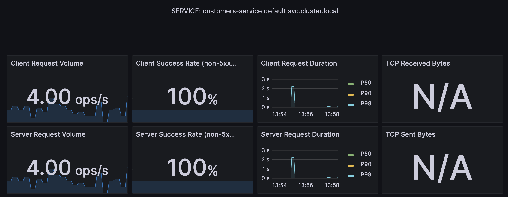
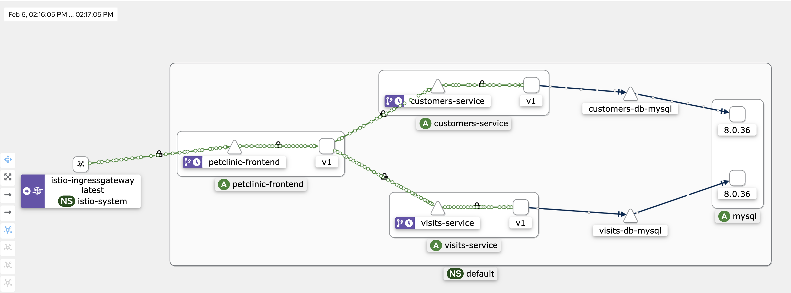

## Distributed Tracing

The Istio documentation dedicates [a page](https://istio.io/latest/docs/tasks/observability/distributed-tracing/overview/#trace-context-propagation) to guide users on how to propagate trace headers in calls between microservices, in order to support distributed tracing.

In this version of PetClinic, all Spring Boot microservices have been configured to propagate trace headers using [micrometer-tracing](https://micrometer.io/docs/tracing).

Micrometer tracing is an elegant solution, in that we do not have to couple the trace header propagation with the application logic.  Instead, it becomes a simple matter of static configuration.

See the [`application.yaml` resource files](https://github.com/spring-petclinic/spring-petclinic-istio/blob/master/petclinic-vets-service/src/main/resources/application.yaml#L56) and the property `management.tracing.baggage.remote-fields` which configures the fields to propagate.

To make testing this easier, Istio is [configured with 100% trace sampling](https://github.com/spring-petclinic/spring-petclinic-istio/blob/master/istio-install-manifest.yaml#L21).

### Observe distributed traces

In its `samples` directory, Istio provides sample deployment manifests for various observability tools, including Zipkin and Jaeger.

Deploy Jaeger to your Kubernetes cluster:

1. Navigate to the base directory of your Istio distribution:

    ```shell
    cd istio-{{istio.version}}
    ```

1. Deploy jaeger:

    ```shell
    kubectl apply -f samples/addons/jaeger.yaml
    ```
   
1. Wait for the Jaeger pod to be ready:

    ```shell
    kubectl get pod -n istio-system
    ```

Next, let us turn our attention to calling an endpoint that will generate a trace capture, and observe it in the Jaeger dashboard:

1. Call the `petclinic-frontend` endpoint that calls both the `customers` and `visits` services.  Feel free to make mulitple requests to generate multiple traces.

    ```shell
    curl -s http://$LB_IP/api/gateway/owners/6 | jq
    ```

1. Launch the jaeger dashboard:

    ```shell
    istioctl dashboard jaeger
    ```

1. In Jaeger, search for traces involving the services `petclinic-frontend`, `customers`, and `visits`.

   You should see one or more traces, each with six spans.  Click on any one of them to display the full end-to-end request-response flow across all three services.

   

Close the Jaeger dashboard.

## Exposing metrics

Istio has built-in support for [Prometheus](https://prometheus.io/) as a mechanism for metrics collection.

Each Spring Boot application is configured with a [micrometer dependency](https://github.com/spring-petclinic/spring-petclinic-istio/blob/master/petclinic-customers-service/pom.xml#L55-L58) to expose a scrape endpoint for Prometheus to collect metrics.

Call the scrape endpoint and inspect the metrics exposed directly by the Spring Boot application:

```shell
kubectl exec deploy/customers-v1 -c istio-proxy -- curl -s localhost:8080/actuator/prometheus
```

Separately, Envoy collects a variety of metrics, often referred to as RED metrics, for: Requests, Errors, and Durations.

Inspect the metrics collected and exposed by the Envoy sidecar:

```shell
kubectl exec deploy/customers-v1 -c istio-proxy -- curl -s localhost:15090/stats/prometheus
```

One common metric to note is the counter `istio_requests_total`:

```shell
kubectl exec deploy/customers-v1 -c istio-proxy -- \
  curl -s localhost:15090/stats/prometheus | grep istio_requests_total
```

Both the application metrics and envoy's metrics are aggregated (merged) and exposed on port 15020:

```shell
kubectl exec deploy/customers-v1 -c istio-proxy -- curl -s localhost:15020/stats/prometheus
```

What allows Istio to aggregate both scrape endpoints are annotations placed in the pod template specification for each application, communicating the URL of the Prometheus scrape endpoint.

For example, [here are the prometheus annotations](https://github.com/spring-petclinic/spring-petclinic-istio/blob/master/manifests/deploy/customers-service.yaml#L40-L43) for the `customers` service.

For more information on metrics merging and Prometheus, see [the Istio documentation](https://istio.io/latest/docs/ops/integrations/prometheus/#option-1-metrics-merging).

## Send requests to the application

To send a steady stream of requests through the `petclinic-frontend` application, we use [siege](https://www.joedog.org/siege-manual/).  Feel free to use other tools, or maybe a simple bash `while` loop.

Run the following `siege` command to send requests to various endpoints in our application:

```shell
siege --concurrent=6 --delay=2 --file=./urls.txt
```

Leave the siege command running.

Open a separate terminal in which to run subsequent commands.

## The Prometheus dashboard

Deploy Prometheus to your Kubernetes cluster:

```shell
kubectl apply -f samples/addons/prometheus.yaml
```

The latest version of Spring Boot (3.2) takes advantage of a relatively recent feature of Prometheus known as "exemplars."  The current version of Istio uses an older version of Prometheus (2.41) that does not yet support exemplars.

Before deploying Prometheus, patch the prometheus deployment to use the latest version of the image:

```shell
kubectl patch deploy -n istio-system prometheus --patch-file=manifests/config/prom-patch.yaml
```

Launch the Prometheus dashboard:

```shell
istioctl dash prometheus
```

Here are some PromQL queries you can try out, that will fetch metrics from Prometheus' metrics store:

1. The number of requests made by `petclinic-frontend` to the `cutomers` service:

    ```promql
    istio_requests_total{source_app="petclinic-frontend",destination_app="customers-service",reporter="source"}
    ```

1. A business metric exposed by the application proper:  the number of calls to the `findPet` method:

    ```promql
    petclinic_pet_seconds_count{method="findPet"}
    ```

## Istio's Grafana metrics dashboards

Istio provides standard service mesh dashboards, based on the standard metrics collected by Envoy and sent to Prometheus.

Deploy Grafana:

```shell
kubectl apply -f samples/addons/grafana.yaml
```

Launch the Grafana dashboard:

```shell
istioctl dash grafana
```

Navigate to the dashboards section, you will see an Istio folder.

Select the Istio service dashboard.

Review the Istio Service Dashboards for the services `petclinic-frontend`, `vets`, `customers`, and `visits`.

The dashboard exposes metrics such as the client request volume, client success rate, and client request durations:



## PetClinic custom Grafana dashboard

The version of PetClinic from which this version derives [already contained a custom Grafana dashboard](https://github.com/spring-petclinic/spring-petclinic-istio/blob/master/grafana-petclinic-dashboard.json).

To import the dashboard into Grafana:

1. Navigate to "Dashboards"
1. Click the "New" pulldown button, and select "Import"
1. Select "Upload dashboard JSON file", and select the file `grafana-petclinic-dashboard.json` from the repository's base directory.
1. Select "Prometheus" as the data source
1. Finally, click "Import"

The top two panels showing request latencies and request volumes are technically now redundant:  both are now subsumed by the standard Istio dashboards.

Below those panels are custom application metrics. Metrics such as number of owners, pets, and visits created or updated.

Create a new Owner, give an existing owner a new pet, or add a visit for a pet, and watch those counters increment in Grafana.

## Kiali

Kiali is a bespoke "console" for Istio Service Mesh.  One of the features of Kiali that stands out are the visualizations of requests making their way through the call graph.

1. Cancel the currently-running siege command.  Relaunch siege, but with a different set of target endpoints:

    ```shell
    siege --concurrent=6 --delay=2 --file=./frontend-urls.txt
    ```

1. Deploy Kiali:

    ```shell
    kubectl apply -f samples/addons/kiali.yaml
    ```

1. Launch the Kiali dashboard:

    ```shell
    istioctl dashboard kiali
    ```

    Select the Graph view and the `default` namespace.

    The flow of requests through the applications call graph will be rendered.

