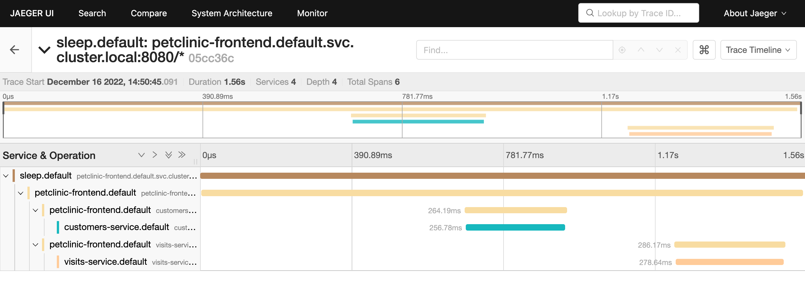

## Observe Distributed Traces

All boot apps are configured to propagate trace headers using [micrometer-tracing](https://micrometer.io/docs/tracing), per the [Istio documentation](https://istio.io/latest/docs/tasks/observability/distributed-tracing/overview/#trace-context-propagation).

See the [`application.yaml` resource files](https://github.com/spring-petclinic/spring-petclinic-istio/blob/master/petclinic-vets-service/src/main/resources/application.yaml#L56) and the property `management.tracing.baggage.remote-fields` which configures the fields to propagate.

To make testing this easier, Istio is [configured with 100% trace sampling](https://github.com/spring-petclinic/spring-petclinic-istio/blob/master/istio-install-manifest.yaml#L21).

### Steps

1. Navigate to the base directory of your Istio distribution:

    ```shell
    cd istio-{{istio.version}}
    ```

1. Deploy Istio observability samples:

    ```shell
    kubectl apply -f samples/addons/prometheus.yaml
    kubectl apply -f samples/addons/jaeger.yaml
    kubectl apply -f samples/addons/kiali.yaml
    kubectl apply -f samples/addons/grafana.yaml
    ```

    Wait for the observability pods to be ready:

    ```shell
    kubectl get pod -n istio-system
    ```

1. Call the `petclinic-frontend` endpoint that calls both the customers and visits services, perhaps a two or three times so that the requests get sampled:

    ```shell
    curl -s http://$LB_IP/api/gateway/owners/6 | jq
    ```

1. Start the jaeger dashboard:

    ```shell
    istioctl dashboard jaeger
    ```

1. In Jaeger, search for traces involving the services petclinic-frontend, customers, and visits.

   You should see new traces, with six spans, showing the full end-to-end request-response flow across all three services.

   

Close the jaeger dashboard.

## Kiali

The Kiali dashboard can likewise be used to display visualizations of such end-to-end flows.

1. Send a light load of requests against your application.

    We provide a simple [siege](https://www.joedog.org/siege-manual/) script to send requests through to the `petclinic-frontend` endpoint that aggregates responses from both `customers` and `visits` services.

    ```shell
    ./siege.sh
    ```

1. Launch the Kiali dashboard:

    ```shell
    istioctl dashboard kiali
    ```

   Select the Graph view and the `default` namespace.  The flow of requests through the applications call graph will be rendered.

## Exposing metrics

Istio has built-in support for Prometheus as a mechanism for metrics collection.

Each Spring Boot application is configured with a [micrometer dependency](https://github.com/spring-petclinic/spring-petclinic-istio/blob/master/petclinic-customers-service/pom.xml#L55-L58) to expose a scrape endpoint for Prometheus to collect metrics.

Call the scrape endpoint and inspect the metrics exposed directly by the Spring Boot application:

```shell
kubectl exec deploy/customers-v1 -c istio-proxy -- curl -s localhost:8080/actuator/prometheus
```

Separately, Envoy collects a variety of metrics, often referred to as RED metrics (Requests, Errors, Durations).

Inspect the metrics collected and exposed by the Envoy sidecar:

```shell
kubectl exec deploy/customers-v1 -c istio-proxy -- curl -s localhost:15090/stats/prometheus
```

One common metric to note is `istio_requests_total`

```shell
kubectl exec deploy/customers-v1 -c istio-proxy -- curl -s localhost:15090/stats/prometheus | grep istio_requests_total
```

Both sets of metrics are aggregated (merged) and exposed on port 15020:

```shell
kubectl exec deploy/customers-v1 -c istio-proxy -- curl -s localhost:15020/stats/prometheus
```

For this to work, Envoy must be given the URL (endpoint) where the application's metrics are exposed.

This is done with a set of [annotations on the deployment](https://github.com/spring-petclinic/spring-petclinic-istio/blob/master/manifests/deploy/customers-service.yaml#L40-L43).

See [the Istio documentation](https://istio.io/latest/docs/ops/integrations/prometheus/#option-1-metrics-merging) for more information.

## Viewing the Istio Grafana metrics dashboards

Launch the grafana dashboard, while maintaining a request load against the application.

```shell
./siege.sh
```

Then:

```shell
istioctl dash grafana
```

Review the Istio Service Dashboards for the three services `petclinic-frontend`, `customers`, and `visits`.

You can also load the legacy dashboard that came with the petclinic application.  You'll find the Grafana dashboard definition (a json file) [here](https://github.com/spring-petclinic/spring-petclinic-istio/blob/master/grafana-petclinic-dashboard.json).  Import the dashboard and then view it.

This dashboard has a couple of now-redundant panels showing the request volume and latencies, both of which are now subsumed by standard Istio dashboards.

But it also shows business metrics exposed by the application.  Metrics such as number of owners, pets, and visits created or updated.
